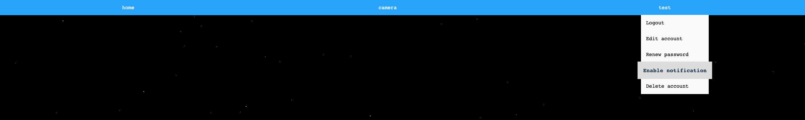
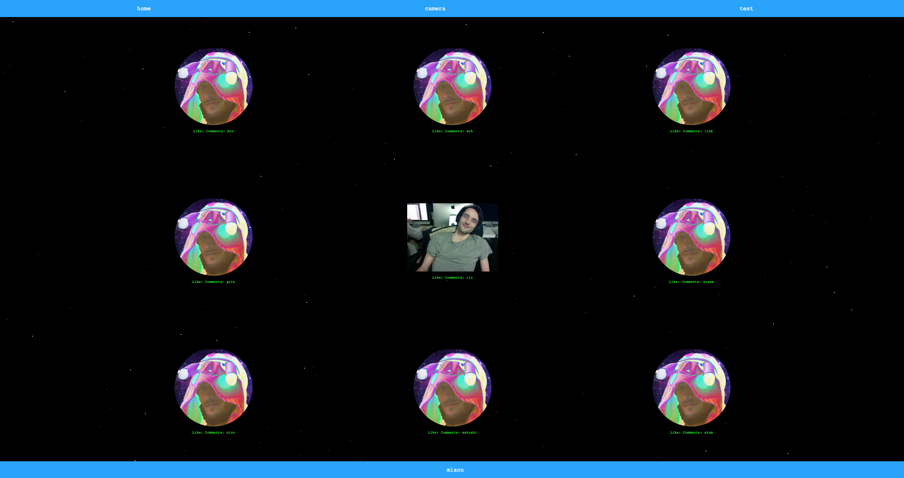
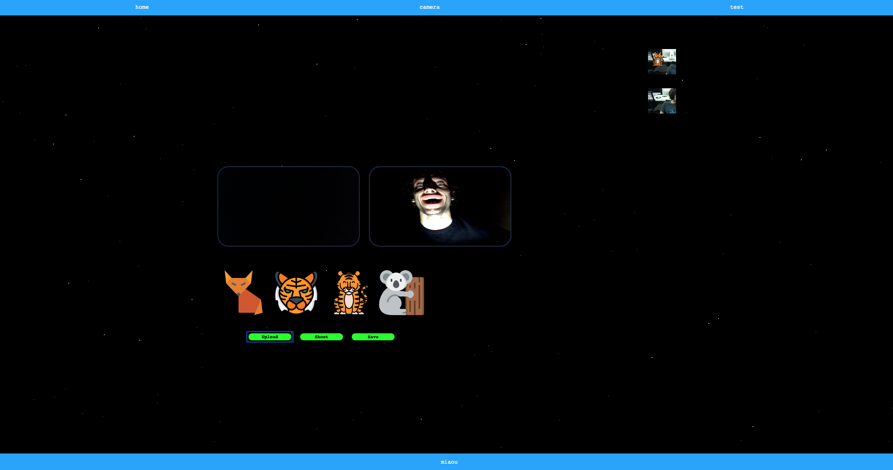
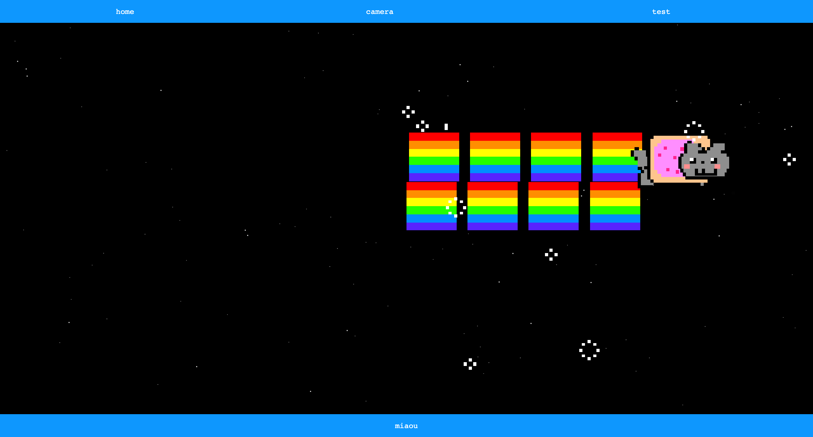

# Camagru

## Introduction

Camagru is the first project of 42 web project branch. You're asked to make a copycat from instagram.
The subject impose html/css/js for the frontend and php for the backend. No frameworks are allowed.
Despite this, ajax/jquery are allowed but i have not used it because i choose to explore mvc instead.

You can find the subject in the pdf directory.

## Account
- User can register, need to validate their account through the link sent by email.
- Once login, they will be able to like and comment pictures, and access to the camera page.
- They can edit their account username and email
- They can delete their account
- They can renew their password (with a email containing the renew link token).
- All of these features are accessible from the navbar

## Homepage
- On the homepage, you can see all pictures that have been taken.
- If a user is log, he can like and comment pictures.
- If a picture is commented, the picture owner will receive an email notification.

## Gallery
- Then on the gallery page, user can upload a picture from either their local storage or the webcam.
- They can add a filter on top of it and take a picture.
- The picture is then added to the homepage where it can be liked an comment by other users.

## Easter Egg

## Setup:

I choose to use docker to host services i needed for the deployment and developement:
- web server: apache 5.6
- database: mysql 5.7 and phpmyadmin
- mail server: used an image from github and the domain of my friend guillaumerx

if you've never install docker, you can pull it with brew:

- brew install docker
- brew install docker-machine
- brew install docker-compose

then your can run it by doing:
- docker-machine create --driver=virtualbox server
- eval $(docker-machine env server)
- docker-compose up
- 192.168.99.100/config/setup.php
- ./setup.sh email add guillaume@guillaumerx.fr password

## Made with love

